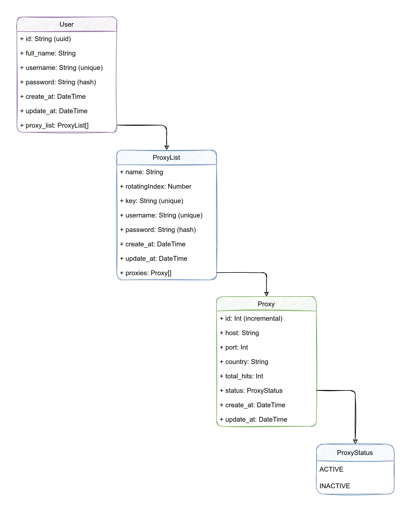

# API

This is the api of exp-proxy-manager. it's built with nestJs & generated with nx.

## Endpoints

It's has total six endpoints;

1. `/auth/sing-up`
2. `/auth/sing-in`
3. `/user`
4. `/proxy-list`
5. `/proxy`
6. `/check-proxy`

user can sign in with validate username or email & password. each can handle CRUD operation with JWT token except `/auth` route. cause it's actually return the JWT token. each endpoint has include body validator for validate the data that user passed at first. It's used class-validator for validation.

### Usage

> Run for listen the server

```bash
yarn nx serve api
```

> Run for build production

```bash
yarn nx build api --prod
```

### API DB diagram


