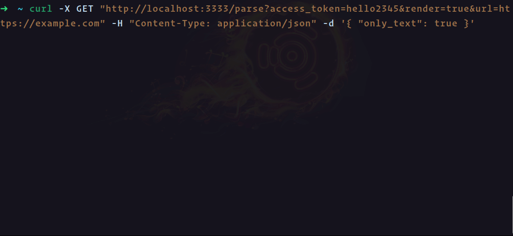
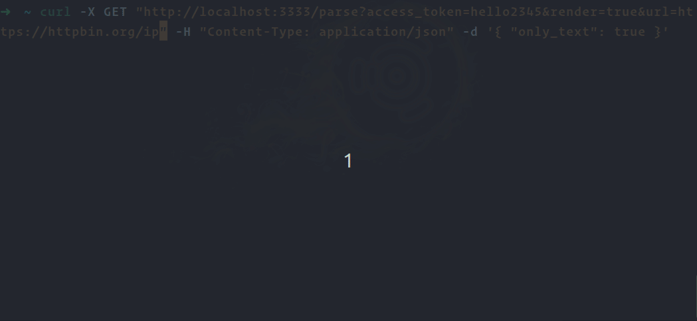

# `@software-sheba/scraper-api`

Rule the scrapping world




## Key features

- **Configuration**: pass your own aspect
  - **Block resources**: block any kind of resource like `jpg, png, gif, mp4` e.t.c. to scrape data blazingly fast.
  - **Solve captchas**: smash the captcha by including one prop only.
- **Instruction**: control the browser with just a bunch of props
  - **Infinity scroll**: no more stuck to scraping in the infinite scroll
- **Extraction**: extract what you want
  - **Nested scrapping**: build your own scraping tree and scrape into deeper and deeper

## Installation

To install all dependencies just run `yarn` or `npm i` (yarn recommended)

```bash
yarn
```

Now run the api with commands below

```bash
# development
yarn dev

# production mode
yarn start:prod
```

## Env setup

First, follow the `example.env` the `PROXY_URL` is optional if you created a `proxies.json` file like `proxies.example.json` & added your proxies. These proxies will use the round-robin method when you try to scrape any webpage.

## How it works

- Easy scraper provides API from which you can scrape data from a web page.
- It supports also proxy rotator mode. in every request, it uses a different proxy (that you provide) and makes you anonymous 🥷.
- Through this api you can control browser by [instructions](#instructions) & scrape by [extract](#extract)
- Also you can modify the browser configuration by [config](#config)
- [Config](#config), [instructions](#instructions) & [extract](#extract) all these feature workable when `render=true`, cause this will enable the javascript executions.

## Query params

There have two queries that are required & one optional to boot the easy scraper engine.

### Api key `access_token: string` (required)

All requests are authenticated using your private API key. Now it's can only one for super admin

```text
GET http://localshot:3333/parse?access_token=exampletoken
```

### Target URL `url: string` (required)

This parameter is the full URL including the protocol (with http/https) of the page to extract data.

```text
GET http://localshot:3333/parse?access_token=exampletoken&url=https://example.com
```

This api call will return the content of example domain

### Render javascript `render: boolean` (optional)

If you would like to enable javascript rendering just pass `render=true` in the query param, this will allow all extra functionality to scrape in more flexibly.

```text
GET http://localshot:3333/parse?access_token=exampletoken&render=true&url=https://example.com
```

## Body structure

By adding different properties it will operate different actions for you. Every property can play their own actions.

```json
{
  "config": {
    // ... configurations
  },
  "instructions": [
    // ... instructions
  ],
  "extract": {
    // ... extractions
  }
}
```

## Config

The config is the configuration of the internal browser, lets see how this can fill your wants

- task: set a configuration to the browser
- method: `GET`
- api: `http://localhost:3333/parse/?access_token=<token>&render=true&url=<target_url>`

| optional params | type                           | description                                | default   |
| --------------- | ------------------------------ | ------------------------------------------ | --------- |
| window_width    | number                         | width of the browser                       | 800       |
| window_height   | number                         | height of the browser                      | 600       |
| device          | mobile or desktop              | select the kind of device                  | undefined |
| own_proxy       | string                         | the proxy url                              | undefined |
| block_resource  | string[]                       | list of extensions you want to block       | undefined |
| block_ads       | boolean                        | block all ads by passing `true`            | false     |
| cookies         | Protocol.Network.CookieParam[] | pass custom cookies to the target webpages | undefined |
| solve captcha   | `{id: string, token: string}`  | captcha id & token                         | undefined |
| stealth_mode    | boolean                        | set `true` for turn on the stealth mode    | false     |

### Viewport width & viewport height

This property can take numbers which will deal as in px.

if you need to change the dimension of the browser's viewport (window) when scraping the target page you can use the window_width and window_height parameters.

```json
{
  "config": {
    "window_width": 1080,
    "window_height": 920
  }
}
```

### Device

Select the kind of device that will send the request to the server. For now only two choices are available, desktop, the default, and mobile.

```json
{
  "config": {
    "device": "mobile"
  }
}
```

### Private proxy

If you want to use our infrastructure with your own proxy, you can use the own_proxy parameter. This will allows you to use all the API features, with your own proxies. this can take a proxy address in the below syntax

```json
{
  "config": {
    "own_proxy": "username:password@proxyaddress.com:port"
  }
}
```

### Block any kind of resource request

This parameter will take an array of extension names. through this, you can easily block any type of resource request. the syntax is like this

```json
{
  "config": {
    "block_resource": ["png", "gif", "jpeg", "jpg"]
  }
}
```

### Block any kind of ads

This parameter will take a boolean value & block any kind of ads from visited web page. the syntax like below

```json
{
  "config": {
    "block_ads": true
  }
}
```

### Solve captchas

If you find any boring captchas in your web page just turn on this property called `captcha_solve: true`. it's will solve in seconds. if you would like top provide your on captcha solver then just drop it `captcha` prop like this.

```json
{
  "config": {
    "id": "the id",
    "token": "your token"
  }
}
```

### Turn on stealth mode

If you would like to use your browser as stealth mode just turn the property like this.

```json
{
  "config": {
    "stealth_mode": true
  }
}
```

### Pass multiple cookies

You can pass custom cookies to the target webpages. to do this you have to pass array of cookies in the `cookies` field. the cookies will follow the `Protocol.Network.CookieParam` [interface](https://vanilla.aslushnikov.com/?Network.CookieParam)

```json
{
  "config": {
    "cookies": [
      // .. Protocol.Network.CookieParam`
    ]
  }
}
```

## Render actions

When then javascript will enable on api you can interact with your passed domain with more fun staffs. let's see how you do

### Scrape only body

Enable `only_body` to scrape only web page body this property will return only body of the web page

```json
{
  "only_body": true
}
```

### Scrape only text

Enable `only_text` to scrape only text. this property will return only text of the web page body.

```json
{
  "only_text": true
}
```

### Take a screenshot

By providing `screenshot: true` in api call body, it will return screenshot buffer of target url in the response.

```json
{
  "screenshot": true
}
```

### Screenshot of full Page

With providing this property it will return the screenshot buffer of full page of the target domain

```json
{
  "screenshot_full_page": true
}
```

### Take a screenshot of a node

This property can take a valid CSS selector, it will return the screenshot buffer of the given element selector

```json
{
  "screenshot_selector": "#selector"
}
```

## Instructions

If you need to interact with the browser, the instructions parameter will help you. remember instructions take an array of objects that can hold many instructions.

> **NOTE**
> You won't get any output by using only instructions

- task: set your browser instructions
- method: `GET`
- api: `http://localhost:3333/parse/?access_token=<token>&render=true&url=<target_url>`

| optional params    | type                   | description                                          |
| ------------------ | ---------------------- | ---------------------------------------------------- |
| wait               | number                 | wait a fixed amount of time                          |
| wait_for           | string                 | wait of a specific element                           |
| click              | string or ClickOption  | click on a specific element                          |
| wait_for_and_click | string or ClickOption  | click on a specific element until the element appear |
| scroll_y           | string or ScrollOption | scroll y axis                                        |
| scroll_x           | string or ScrollOption | scroll x axis                                        |
| fill               | FillOption             | fill a specific input filed                          |
| evaluate           | string                 | add any kind of script to run in the target page     |

> The syntax

```json
{
  "instructions": [
    {
      //...your instructions
    },
    {
      //...your instructions
    }
  ]
}
```

### Wait for a fixed time

If you would like to wait a fixed amount of time just add it in instructions object like this.

```json
{
  "instructions": [
    {
      "wait": 1000 // this number will count in ms
    }
  ]
}
```

### Wait for an element

If you would like to wait for an element just add it in instructions object like this.

```json
{
  "instructions": [
    {
      "wait_for": "#selector"
    }
  ]
}
```

It can take a valid CSS selector.

### Click on an element

If you would like to click on an element just add it in instructions object like this.

```json
{
  "instructions": [
    {
      "click": "#selector"
    }
  ]
}
```

It will take a valid CSS selector. This parameter can take a `ClickOption` as well.

```ts
type MouseButton = 'left' | 'right' | 'middle' | 'back' | 'forward';

interface ClickOption {
  selector: string;
  delay?: number;
  button?: MouseButton;
  clickCount?: number;
}
```

### Wait for an element and click

This property is a combination of `wait_for` & `click`

```json
{
  "instructions": [
    {
      "wait_for_and_click": "css-selector" // or ClickOption
    }
  ]
}
```

### Scroll X and Y axis

If you need to scroll the X or Y axis on the web page just use this magical parameter. It will very helpful for infinite scrolling. let's see the syntax

```json
{
  "instructions": [
    {
      "scroll_y": 5400,
      "scroll_x": {
        "selector": "#div2",
        "amount": 35,
        "scrollCount": 5,
        "delay": 1000,
        "behavior": "smooth"
      }
    },
    {
      "scroll_x": 3000,
      "scroll_y": {
        "selector": ".nothing",
        "amount": 3500,
        "scrollCount": 20,
        "delay": 3000,
        "behavior": "smooth"
      },
      "wait": 5000
    }
  ]
}
```

This can take numbers or objects like the `ScrollOption` interface. the number will amount to px.

```ts
interface ScrollOption {
  selector?: string; // the parent element selector you want to scroll
  amount: number; // the number of px you want to scroll in each count
  delay?: number; // the delay of each scroll in ms
  scrollCount?: number; // the amount of scroll you want to scroll
  behavior?: 'auto' | 'smooth'; // the scroll behavior default auto
}
```

### Fill input filed

If you would like to fill in any input field this parameter will help you. It takes an object like this below

```json
{
  "selector": "#input-selector", // the input selector
  "text": "foo bar", // the text you want to fill
  "delay": 1000 // the typing delay in ms
}
```

### Evaluate script

If you need more flexibility and need to run custom JavaScript, you need to use this instruction.

Suppose you want to run the code `console.log('foo')` on the webpage you need to use this `evaluate` property like this below

```json
{
  "instructions": [{ "evaluate": "console.log('foo')" }]
}
```

## Extract

This is an extraction object to extract data in JSON format. the structure of extraction is like this

> The syntax

```json
{
  "extract": {
    "key_name": ".el",
    "key_name-2": {
      "selector": ".anchor-el",
      "type": "list",
      "output": "@href"
    },
    "key_name-3": {
      "selector": ".parent-el",
      "type": "list",
      "output": {
        "key_name": ".child-el",
        "key_name-2": {
          "selector": ".child-anchor",
          "type": "list",
          "output": "@href"
        }
      }
    }
  }
}
```

> example output

```json
{
  "key_name": "the inner text of selected element (.selector), null if not found",
  "key_name-2": [
    // the list of hyper links of selected anchor element (.anchor-el)
  ],
  "key_name-3": [
    {
      "key-name": "the inner text of selected element (.parent-el .child-el), null if not found",
      "key_name-2": [
        // the list of hyper links of selected anchor element (.parent-el .anchor-el)
      ]
    }
  ]
}
```

This can take `ExtractOption`, remember `output` can take also the `ExtractDto` interface to nested scrapping.

```ts
interface ExtractionDto {
  [property: string]: string | ExtractOption;
}

interface ExtractOption {
  selector: string;
  type?: 'item' | 'list'; // default 'item'
  output?: string | ExtractDto;
  clean?: boolean; // default false
}
```

### Single element or list (type) [list | item]

Typically it will return you the first HTML element that matches the selector. If you want to get all elements from the matching selector, you should use the type option. type can be:

- `item` return first element matching the selector (default)
- `list` return a list of all elements matching the selector

> example input

```json
{
  "first_post_title": {
    "selector": ".post-title",
    "type": "item"
  },
  "all_post_title": {
    "selector": ".post-title",
    "type": "list"
  }
}
```

> example output

```json
{
  "first_post_title": "  First title",
  "all_post_title": [
    "   First title",
    "   second title",
    // ...
    "  second last title",
    "  last title"
  ]
}
```

### Clean text (clean) [true | false]

By default, it will return you the content returned will be not cleaned. Meaning it will not remove trailing spaces, and empty characters from it ('\n', '\t', etc...). If you don't enable this behavior, you should use the clean: true option.

> example input

```json
{
  "first_post_description": {
    "selector": ".card > div"
  },
  "second_post_description": {
    "selector": ".card > div:nth-child(2)",
    "clean": true
  }
}
```

> example output

```json
{
  "first_post_description": "this    is  a first post\n description",
  "second_post_description": "this is a second post description"
}
```

### Output format

For a given selector, you can extract different kinds of data using the output option:

| Option         | Description                           |
| -------------- | ------------------------------------- |
| text (default) | text content of selector              |
| html           | HTML content of selector              |
| @...           | attribute of selector (prefixed by @) |
| table_json     | JSON representation of a `<table>`    |
| table_array    | Array representation of a `<table>`   |

### output overview

> example input

```json
{
  "heading_text": {
    "selector": "h1",
    "output": "text"
  },
  "heading_html": {
    "selector": "h1",
    "output": "html"
  },
  "heading_id": {
    "selector": "h1",
    "output": "@id"
  },
  "table_array": {
    "selector": "table",
    "output": "table_array"
  },
  "table_json": {
    "selector": "table",
    "output": "table_json"
  }
}
```

> example output

```json
{
  "heading_text": "I am the title",
  "heading_html": "<h1 id=\"heading\">I am the title</h1>",
  "heading_id": "heading",
  "table_array": [
    ["row one column one", "row one column two"],
    ["row two column one", "row two column two"],
    ["row three column one", "row three column two"],
    ["row four column one", "row four column two"]
  ],
  "table_json": [
    {
      "Heading 1": "row one column one",
      "Heading 2": "row one column two"
    },
    {
      "Heading 1": "row two column one",
      "Heading 2": "row two column two"
    },
    {
      "Heading 1": "row three column one",
      "Heading 2": "row three column two"
    },
    {
      "Heading 1": "row four column one",
      "Heading 2": "row four column two"
    }
  ]
}
```

### Nested Scraping

Also you can provide your custom `ExtractDto` structure by adding in the `output` for nested scraping. Lets see an example with [hacker news](https://news.ycombinator.com/)

> example input

```json
{
  "extract": {
    "articles": {
      "selector": ".athing",
      "type": "list",
      "output": {
        "title": ".titleline > a",
        "title_link": {
          "selector": ".titleline > a",
          "output": "@href"
        },
        "subtitle": ".sitebit",
        "subtitle_link": {
          "selector": ".sitebit > a",
          "output": "@href"
        }
      }
    }
  }
}
```

> example output

```json
{
  "articles": [
    {
      "title": "the first title",
      "title_link": "the first title link",
      "subtitle": "the first subtitle",
      "subtitle_link": "the first subtitle link"
    },
    //...
    {
      "title": "the last title",
      "title_link": "the last title link",
      "subtitle": "",
      "subtitle_link": ""
    }
  ]
}
```

**NOTE**: If any property value isn't found it will return an empty string on that specific object.

## Credits

These open source softwares help us to build this api

1. [Typescript](https://www.typescriptlang.org/)
2. [NestJs](https://nestjs.com/)
3. [Puppeteer](https://pptr.dev/)
4. [Puppeteer-extra](https://www.npmjs.com/package/puppeteer-extra)
5. [Normalize-url](https://www.npmjs.com/package/normalize-url)
