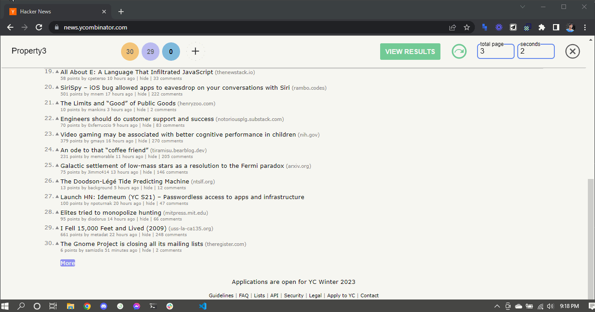

# `@software-sheba/web-scraper-extension`

A web scraper extension for google chrome

## Key Features

- Scrape data through unique property name
- Paginate and scrape data from multiple pages
- Scrape data from infinity scroll webpage (coming soon)
- View data in fancy table & json format
- Download data as CSV or JSON
- Save recipe to run & scrape new data to ignore repeated selection
- Mange all recipes locally

## How to use on development mode

- Clone this repo
- Install dependencies using `npm install` or `yarn` (recommended)
- Fire the server using `npm start` or `yarn start`
- Server is running at [localhost:3000](http://localhost:3000/) with the mock markup of [hackernews](https://news.ycombinator.com/)
- Lets scrape 🚀

## How to use on production mode (Chrome Extension)

- Clone this repo
- Install dependencies using `npm install` or `yarn` (recommended)
- Run the `yarn build` command for production built.
- Now the extension will be built and ready to use
- Navigate to `chrome://extensions`
- Expand the Developer drop down and click “Load unpacked extension”
- Navigate to the `build` directory where you put your code and click Ok
- Lets scrape the Web 🚀

## How it works

This extension can help you to scrape data from any webpage. just follow these steps to easily scrape data from any web page.

### Launch extension

After adding the production build file to fire the extension, just click the EWS icon, and it will render smoothly on the existing website. let's see visually how it's rendering.

### Detect related data

To select specific data just hover on it, and click the element it will detect all related data, see how

And click the target selection to remove all selections.

### Rename detect data

Let's select all titles & subtitles. You can rename each scraper data that you select. By default, it's renamed `property (n+1)`. But don't worry it's customizable. Let's see

### Clear, edit & delete selections

After saving the data you can easily clear all states by clicking the clear icon and edit it by clicking the scraped bubble. Click the cross icon to delete the stored selection which will appear after hovering a bubble.

> clear selections
> 

> edit & delete scraped selections
> 

### View result

After selecting scraped elements the view result button automatically activates. Then you can click this to show the results table on a new page. see how

### Pagination scrape

If you want to scrape multiple pages then you have to select the pagination next button it will press the amount which you provide in the `total pages` field. `seconds` field takes delay time in seconds to press the pagination delay

To remove the pagination mode just click on the selected pagination button.

> download all scraped data in CSV & JSON format by clicking results bottom buttons.

### Recipe

The most wonderful feature is the recipe, you can save your last scraped process as a recipe so you can run it many times & pick the new data through just one click. Let's see how

### Run recipe

You can run your recipe thousand times to get updated data based on your recipe

## Credits

This software uses the following open source packages:

- [TypeScript](https://www.typescriptlang.org/)
- [React](https://www.reactjs.org/)
- [Create-React-App](https://create-react-app.dev/)
- [Redux-Toolkit](https://redux-toolkit.js.org/)
- [Lodash](https://www.lodash.com)
- [json2csv](https://www.npmjs.com/package/json2csv)

Lets do fun with Easy web scraper
