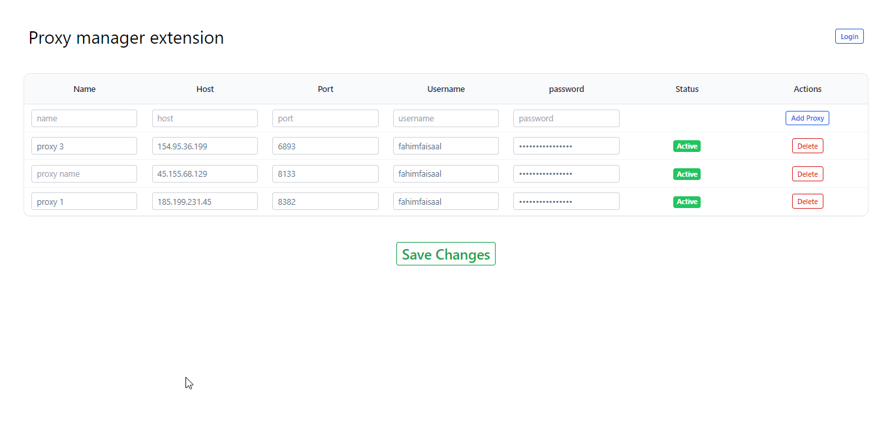

This extension is compatible with any proxy provider of your choice, providing you with the ability to add and enable your proxies. You will also have a dashboard table to manage your proxies in a simple and intuitive way.

:::info Info

Include local proxies by clicking the `Add Proxy` button.
