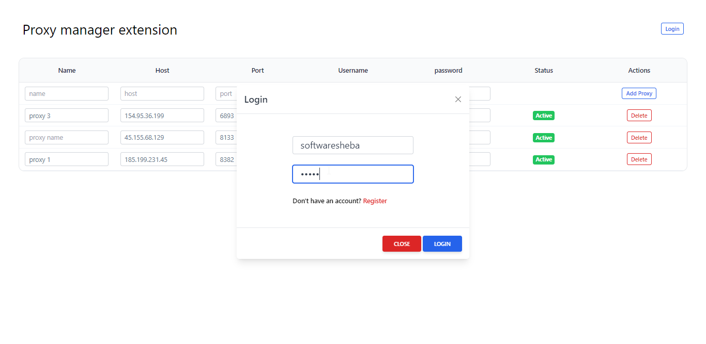
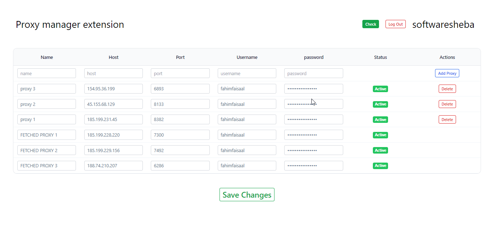
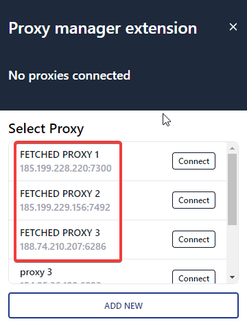

Further adding local proxies, you can retrieve all proxies from your proxy manager account. These proxies are also connectable. To access them, you will need to log in to your easy proxy manager account using your credentials.

---

## Inside dashboard

Now you can watch your all proxies those you stored in your **Easy proxy manager** app

## Inside popup

Furthermore you can view the fetched proxies inside the extension popup. This will provide you with a list of all of the proxies that are available for use, allowing you to easily switch between them as needed

