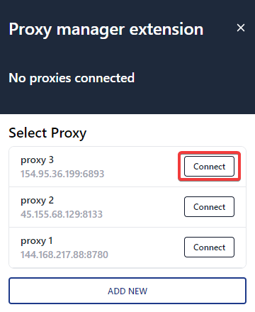
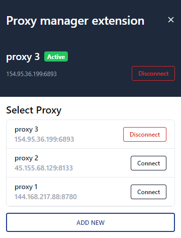
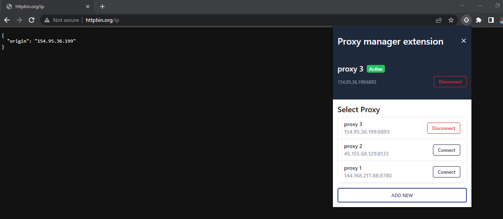

Proxy Manager is a free Chrome browser proxy extension that has all of the essential features to manage proxy in your browser. You can easily add and switch between multiple proxies through a one-click connection.

## Boot extension

After installation, simply click on the extension icon to launch the popup interface. From there, you can easily manage and configure your proxy servers. The user-friendly interface makes it easy to quickly set up and use the extension.

## Connect proxy

To connect your proxy with the Chrome browser, simply click on the Connect button within the proxy manager extension. This will establish a connection between the proxy and your browser, allowing you to securely and anonymously browse the web.

## Test

Hitting the **http://httpbin.org/ip** with connected **proxy 3**

