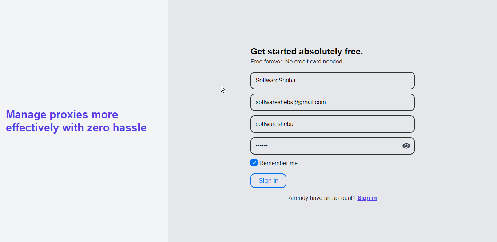
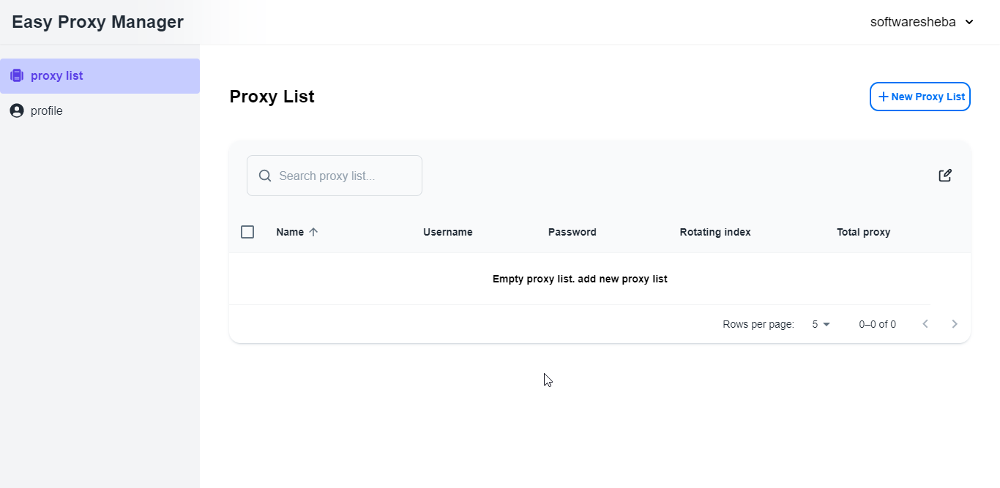

The client route of this page is `/auth/sign-up`

## Create an account

After clicking the Sign up button the POST `/api/auth/sign-up` will be called & redirect to the `/proxy-list` page

## The proxy list page

This page hold all proxy list in a single table. Whether you can manage all proxy lists visually.

