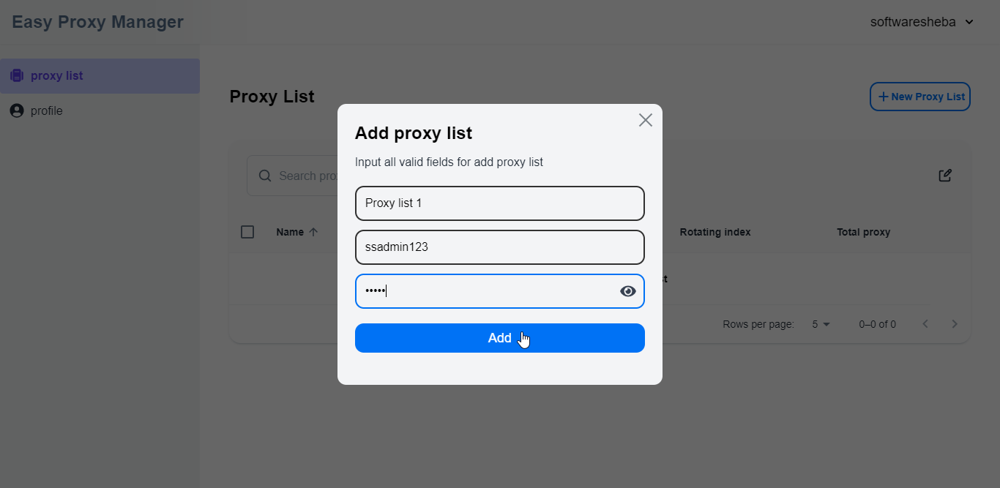

The client route of this page is `/auth/proxy-list`

## Create a proxy list

After clicking the **Add** button POST `/api/proxy-list/new` API will be invoked.

:::info
The `username` & `password` fields are optional. It will generate random `username` based on the real `username` & create a random password. Once it gets empty
:::
