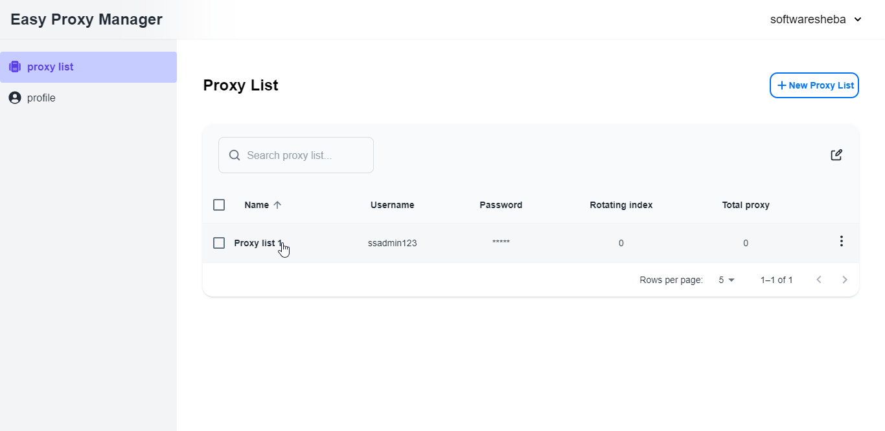
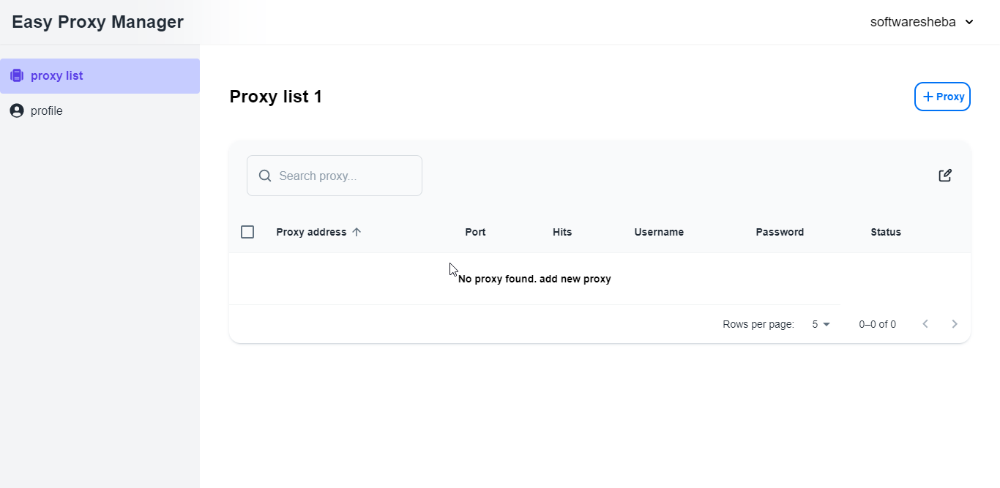

The client route of this page is `/auth/proxy-list/{username}`

## Go to proxy list page

On clicking the name of the proxy list, it will redirect to the proxy list page & try to fetch all proxies from the proxy-list, it will show an empty message if the proxy list doesn’t have any proxies. This action will call the API's **GET** `api/proxy-list/username` method.

