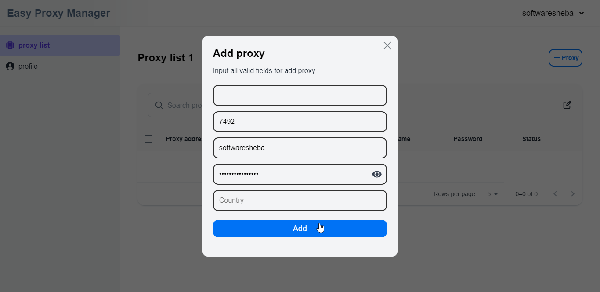
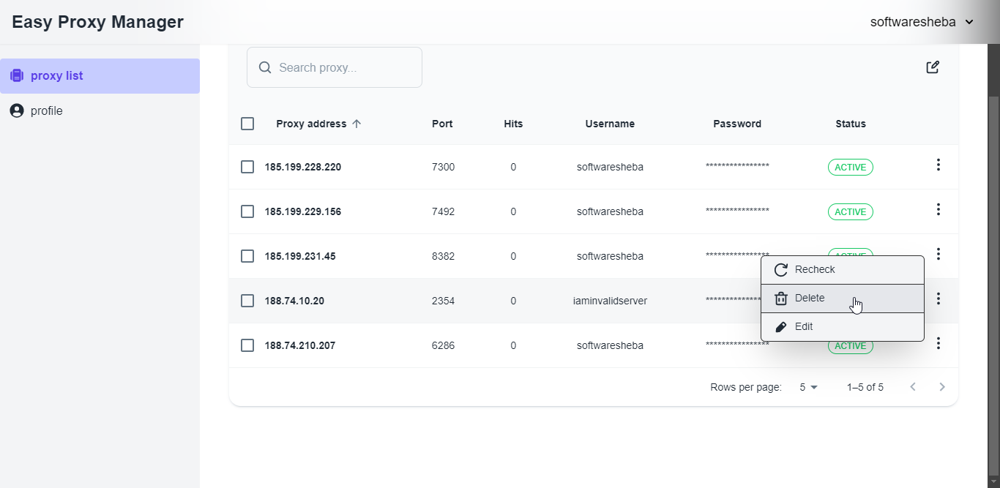
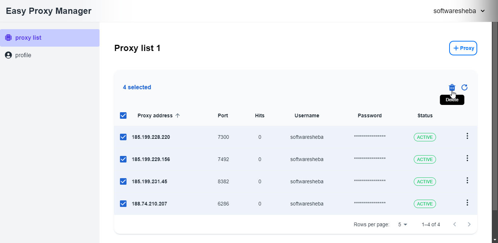
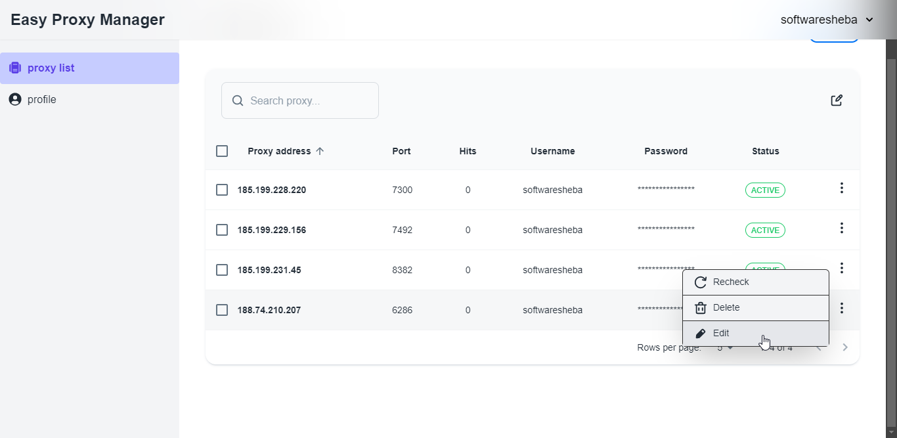
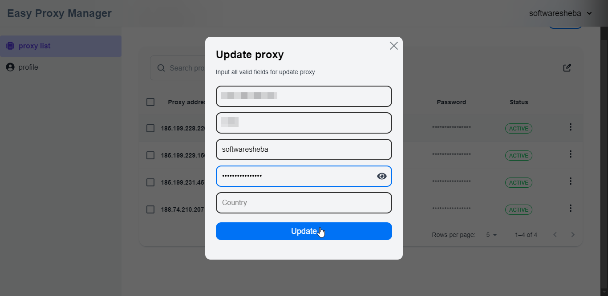
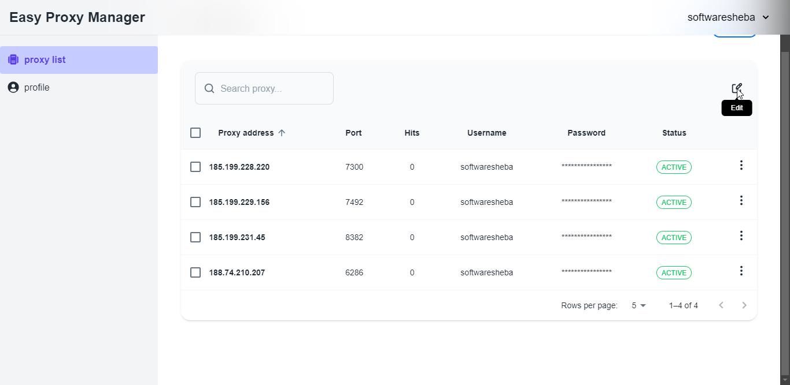
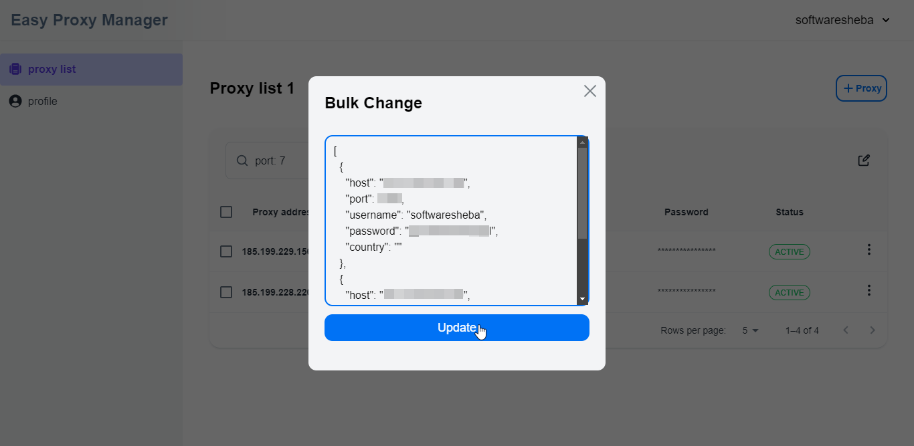
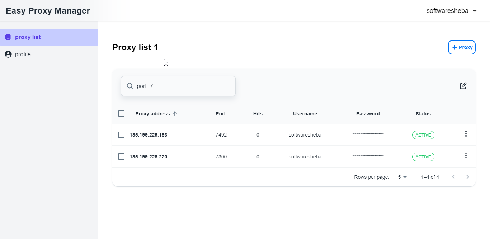

The client route of this page is `/auth/proxy-list/{username}`

## Create proxy inside proxy list table 🆕

To create a proxy, click the proxy button and fill out all of the required information. The host & port are required. Then after pressing the `Add` Button it will invoke two API

1. **POST** `/api/proxies/new`
2. **PATCH** `/api/proxies/check`

Initially, the proxy status will be `CHECKING`

:::note
Every field validate their own data.
:::

Adding some more proxies

## Delete proxies 🔫

This allows users to delete a specific proxy from the proxy table by just clicking the individual Delete button. Also, users can delete bulk proxy files by selecting and pressing the trash icon. Both actions will invoke the **PATCH** `/api/proxies/delete` endpoint.

### Bulk delete

Users can delete multiple proxies at the same time by selecting option.

## Edit proxies 🚧

By clicking the individual Edit button, users can edit a specific proxy from the proxy table. It will open a form modal to edit all properties visually. It will update the changes once the Update button is pressed. This action will invoke the PATCH `/api/proxies/update` endpoint.

### Bulk Edit

This allows users to edit the bulk proxy from the proxy table by just clicking the Edit icon. It will open a JSON modal to edit all proxy information in JSON format. It will update the changes once the `Update` button is pressed. This action will also invoke the PATCH `/api/proxies/update` endpoint.

:::note
This also validates the input. if the user input any wrong structure or input it will show the error message
:::

## Filter & search proxies 🔍️

The search bar allows users to filter and search based on the table heading. also Users can search by a random string then it will filter on the `Proxy address`

