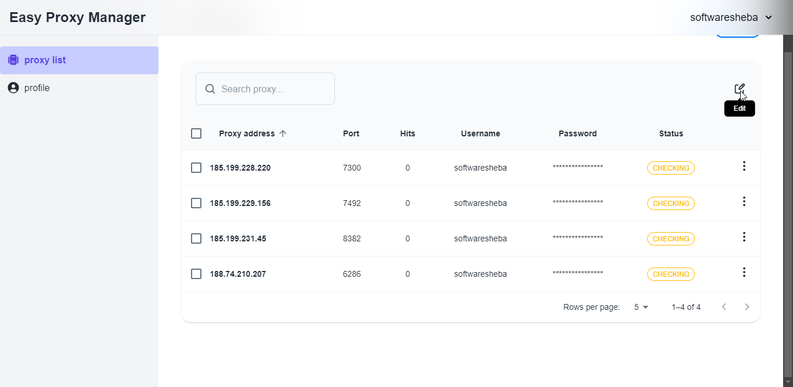

The recheck feature allows users to check the current status of the proxy server is it active or inactive? By clicking the "`Recheck`" button, the UI will show the `CHECKING` status & it will return to the current status while the check process is completed.

Users can all check their custom selection proxies. by selecting the proxy on the left side. Both actions will invoke the **PATCH** `/api/proxies/check` endpoint

> Clicking the proxy recheck button

> Checking the proxy status

## Bulk Rechecking

> Clicking the bulk recheck proxy button

> Checking all proxies at the same time

