Let's take a look at how you manage & connect your proxies through the extension.

## Open Extension 📭️

After uploading & pinned the extension it will render on clicking the extension icon

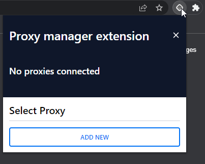

## Add local proxies 🆕

To add or open the extension dashboard, you have to press the ADD NEW button.

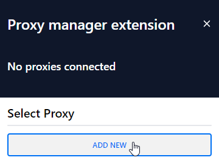

Here is the extension dashboard, where all proxies will be managed

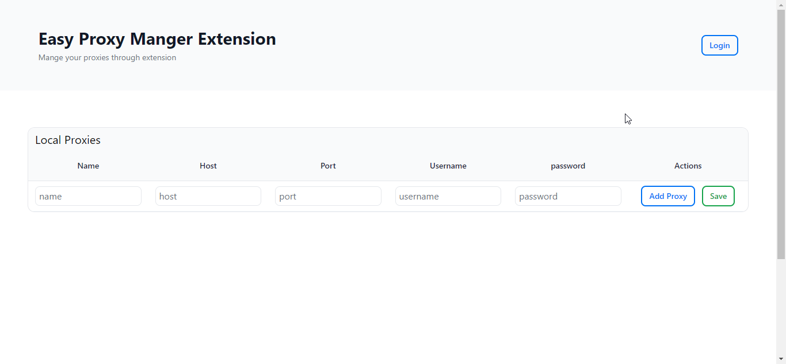

Adding one and multiple local proxies

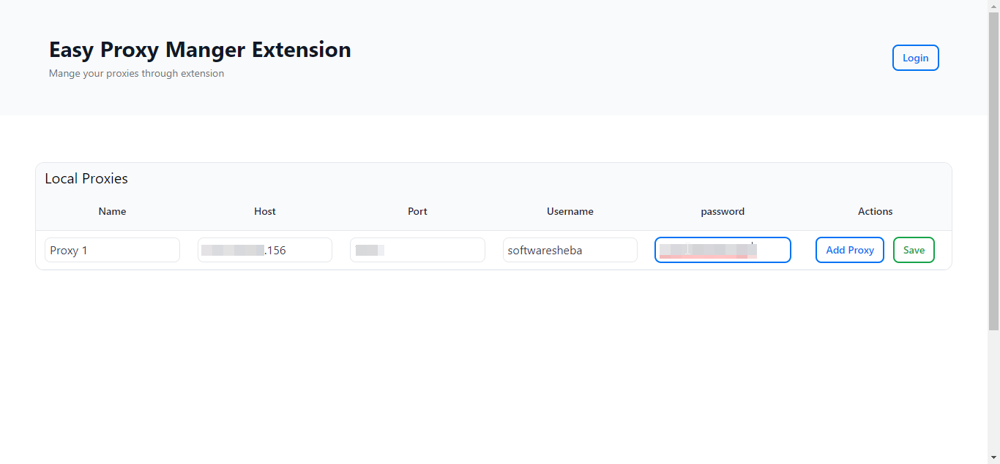

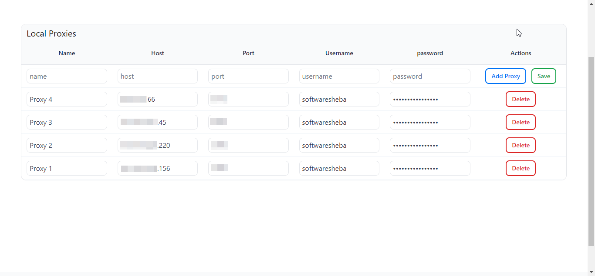

:::note
The change will not happen if users don’t click the `Save` button after any changes
:::

> The popup saving the changes

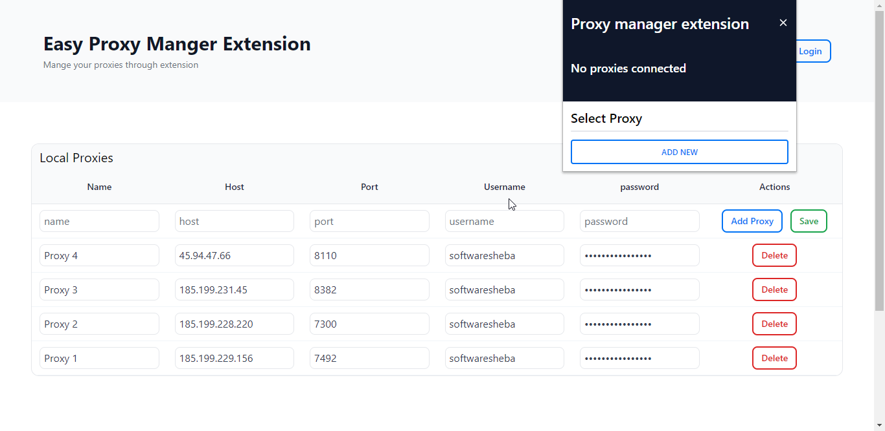

> Clicking the `Save` button

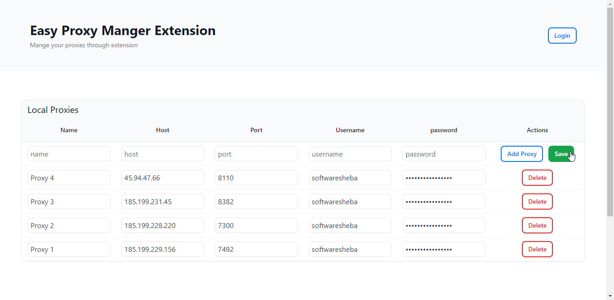

> The popup view after save changes

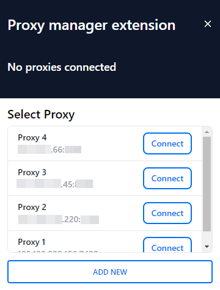

## Connect local proxy 🔌

Users can connect their proxy by clicking `connect` button. Lets try with [`https://httpbin.org/ip`](https://httpbin.org/ip) and see how it works.

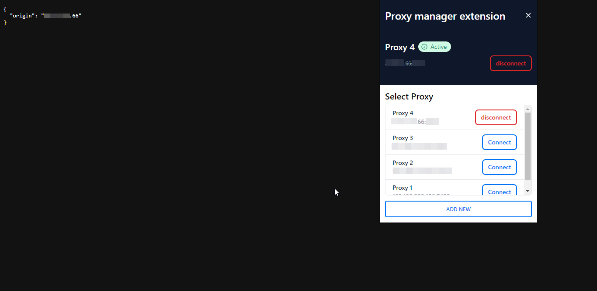

## Log in to the proxy manager account 🏃🏻

Users can log in with their proxy manager dashboard credentials. Let's login with the previous credentials. After login, the proxy list is automatically fetched from the account. Under the hood, this is calling the **GET** `/api/proxy-list` API. All fetched proxy lists will appear in another table.

Furthermore, users can check their proxy list by pressing the `check` button. In order of priority, all proxies retrieved will appear at the top of the popup HTML.

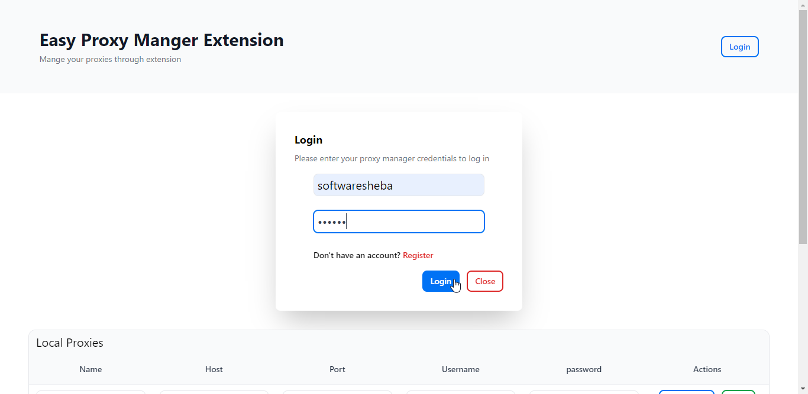

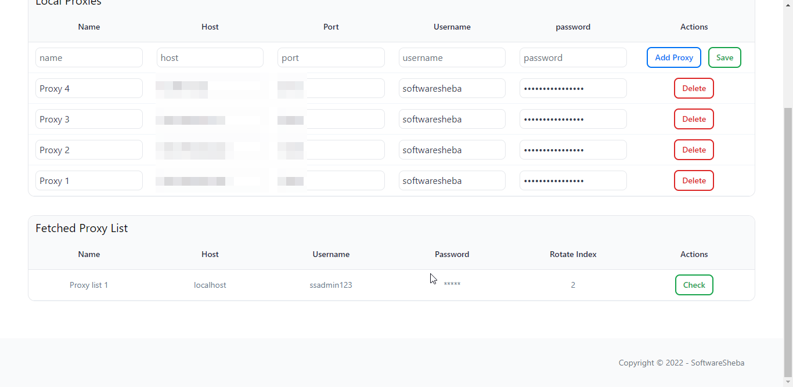
