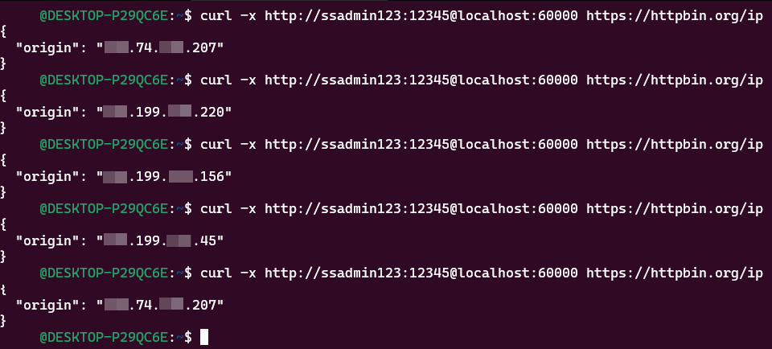

First, it searches the proxy list records using the designated username. Once the password matches, the app authenticates the user and returns the appropriate rotating proxy. If the proxy has a username and password, these details are passed as authentication in the proxy request. The app also has a feature that increments the `rotatingIndex` by `1` after each request. If the index exceeds the length of the proxy list, it resets to `0` and begins the process again. This ensures that users have access to a diverse range of proxies and helps maintain a secure connection to the internet. For more information about this process, you can check out the `getRotateProxy` function to see the workflow.

The returned proxy looks like this:

```ts
interface Proxy {
  host: string;
  port: number;
  auth?: string; // format ->`username:password`
}
```

After this, it invokes the `generateClientRequest` function, which creates a new request option and includes the proxy authorization by the proxy into the header, and finally sends the request.

Let's take a look at an example from the proxy list that was previously shown on the dashboard to see how it works


